# Navigation Map — Amanah Quran

This document maps all observed user navigation pathways across **Amanah Quran (v2.2.0)**.

```mermaid
graph TD
    Launch[OS Launch / App Icon] -->|Immediate minimal transition| Home[HomeScreen S002]
    
    %% Main Reading Pathways
    Home -->|Tap Surah Index| SurahList[SurahListScreen S003]
    Home -->|Tap Juz Index| JuzList[JuzListScreen S004]
    Home -->|Tap Page Index| PageList[PageListScreen S005]
    Home -->|Tap Open Mushaf Page| MushafReader[MushafPageScreen S007]
    Home -->|Tap Daily Ayah Open| ExactAyahDaily[Reader ExactAyah S006]
    
    SurahList -->|Tap Surah Item| SurahReader[SurahReaderScreen S006]
    JuzList -->|Tap Juz Item| JuzReader[JuzReaderScreen S006]
    PageList -->|Tap Page Item| PageReader[PageReaderScreen S007]
    
    %% Reader Interactions
    SurahReader -->|Tap Ayah| AyahActionCard[ReaderSelectedAyahActionCard]
    AyahActionCard -->|Toggle Bookmark| BookmarkToggle[Local DB Bookmark Stored]
    AyahActionCard -->|Share Text| SystemShare[Android Share Sheet]
    
    %% Direct Feature Navigation from Home
    Home -->|Tap Search| Search[SearchScreen S008]
    Home -->|Tap Bookmarks| Bookmarks[BookmarksScreen S009]
    Home -->|Tap Daily Ayah History| DailyHistory[DailyAyahHistoryScreen S017]
    Home -->|Tap Reading Streak| Streak[ReadingStreakScreen S015]
    Home -->|Tap Reading Activity| Activity[ReadingActivityDashboardScreen S018]
    Home -->|Tap Trust Center Icon/Card| TrustCenter[TrustCenterScreen S014]
    Home -->|Tap Settings Icon| Settings[SettingsScreen S010]
    
    %% Search to Reader
    Search -->|Tap Search Result| ExactAyahSearch[Reader ExactAyah S006]
    
    %% Bookmarks to Reader
    Bookmarks -->|Tap Bookmark Item| ExactAyahBookmark[Reader ExactAyah S006]
    
    %% Streak Sub-Navigation
    Streak -->|Tap Open Calendar| Calendar[ReadingCalendarScreen S016]
    
    %% Settings Hierarchy
    Settings -->|Tap Reading Reminders| Reminder[ReadingReminderScreen S011]
    Settings -->|Tap Advanced Reader| AdvancedSettings[AdvancedReaderSettingsScreen S012]
    Settings -->|Tap Trust Center| TrustCenter
    AdvancedSettings -->|Tap Reset Reading| ResetSettings[ResetReadingSettingsScreen S013]
    
    %% Global Back Navigation
    SurahReader -->|Back Navigation| SurahList
    SurahList -->|Back Navigation| Home
    JuzReader -->|Back Navigation| JuzList
    JuzList -->|Back Navigation| Home
    PageReader -->|Back Navigation| PageList
    PageList -->|Back Navigation| Home
    Search -->|Back Navigation| Home
    Bookmarks -->|Back Navigation| Home
    Settings -->|Back Navigation| Home
    TrustCenter -->|Back Navigation| Home
    Activity -->|Back Navigation| Home
    Streak -->|Back Navigation| Home
    Calendar -->|Back Navigation| Streak
    DailyHistory -->|Back Navigation| Home
    Reminder -->|Back Navigation| Settings
    AdvancedSettings -->|Back Navigation| Settings
    ResetSettings -->|Back Navigation| AdvancedSettings
```

## Navigation Patterns & Architecture
1. **Root Destination**: `AppRoute.Home` is the universal launch destination.
2. **Flat Navigation Hierarchy**: The app avoids deep nesting. All core destinations (Surah, Juz, Page, Search, Bookmarks, Trust Center, Settings) are directly accessible from Home in 1 tap.
3. **No Bottom Navigation Bar**: The app intentionally uses an uncluttered dashboard card model on Home rather than persistent bottom navigation tabs. This maximizes screen real estate for the sacred reading experience.
4. **Deterministic Anchor Routing**: Jumping from Search, Bookmarks, Daily Ayah, or History to the Reader utilizes canonical `ReaderAnchor.ExactAyah(ayahKey)` or `ReaderAnchor.PageStart`, ensuring exact verse positioning.
5. **Back Navigation Integrity**: Android system back and top bar back icons consistently pop the backstack to the immediate parent destination without erratic transitions or lost state.
6. **Zero External Links**: No external browser intents or network links exist inside the app, ensuring complete offline isolation.
